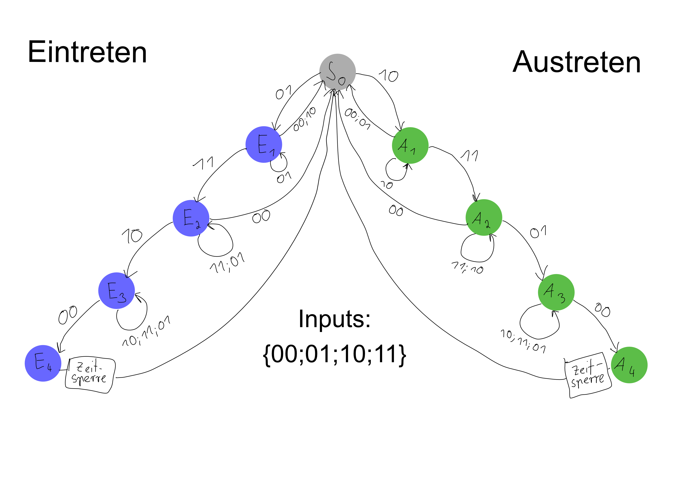
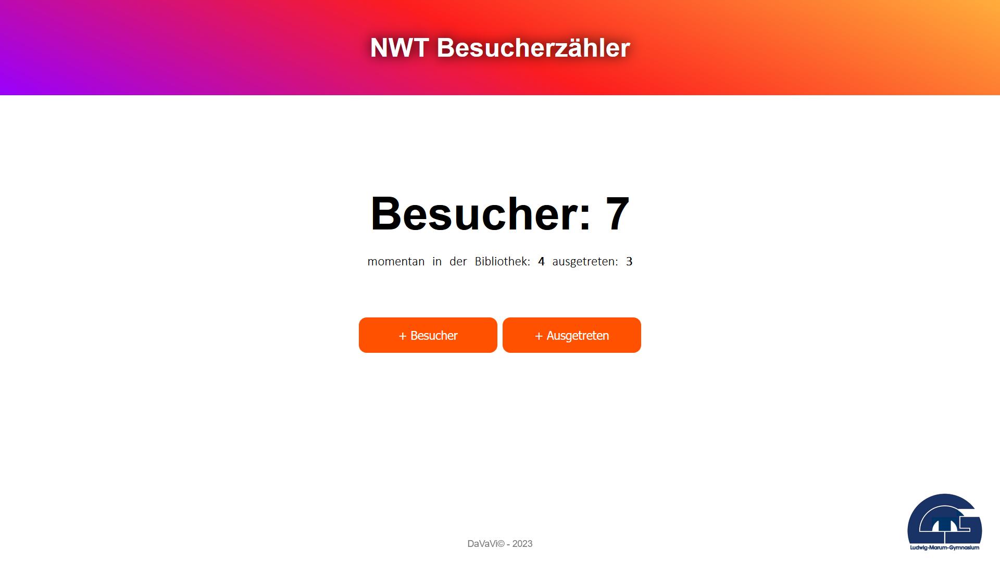

# Dokumentation

## Einleitung

Dieses Dokumentation beschreibt den Werdegang unseres Projektes "Einen Besucherzähler bauen", welches wir im Zuge unseres NWT Unterrichts in der Schule und Zuhause vom 29.11.2022 bis am 22.3.2023 bearbeitet haben. Das Projekt wurde von der Bibliothekarin Frau Ehrler in Auftrag gegeben. Das Ziel war es einen Besucherzähler für die Bücherei zu bauen, der dort die Besucher zählen kann.
Es werden Erläuterungen zur Funktionsweise sowie Skizzen und Fotos von verschiedenen Bereichen der Arbeitsphase zur Veranschaulichung und Erklärung unseres Projektes dargestellt.
Ziel dieser Dokumentation ist es, den allgemeinen Prozess des Projektes, von Start- und Planungsphase bis zu Installation und Fazit unseres Projektes aufzuzeigen und zu verdeutlichen

## Start- und Planungsphase: 

Um die Personen zu erfassen, welche die Bibliothek besuchen, entschieden wir uns für zwei Infrarotsensoren. Somit brauchen wir keinen Reflektor auf der anderen Seite. Zum Auslesen dieser Daten benutzen wir einen Raspberry Pi. Am Anfang wussten wir noch nicht, wie Frau Ehrler die Daten bekommen und lesen soll. Unser Ziel war es jedoch die Daten des Besucherzählers auf einer Webseite darzustellen, damit die Besucherzahl über Computer, Handy oder Tablet erreichbar ist. Vorteilhaft an dieser Lösung ist, dass der Raspberry Pi keinen eigenen Display braucht.
Zu Beginn überlegten wir, ob wir einen schon fertigen Besucherzähler im Internet kaufen wollen und uns nur auf die Benutzeroberfläche konzentrieren, oder den Besucherzähler und die Website selber programmieren. Wir entschieden uns dafür, einen kompletten Besucherzähler zu bauen.
Nach dem Kick-Off Gespräch am 7.12.2022 schickten wir Frau Ehrler unser Projektangebot, welchem sie zustimmte. Dieses Angebot lässt sich in folgenden Muss-, Soll- und Kann-Zielen definieren.

Muss-Ziel: 
* Einen Besucherzähler programmieren und in der Bücherei installieren. Die von dem Besucherzähler erfassten Messdaten leicht abrufbar machen

Soll-Ziel: 
* Eine freundliche Benutzeroberfläche zu designen und eine handliche und schöne Hardware zu entwerfen. 

Kann-Ziel: 
* Die Messwerte möglichst auf allen Geräten in der Bücherei abrufbar machen.


## Funktionsweise

Auf dem Raspberry Pi läuft das Betriebssystem [Raspberry Pi OS Lite](https://www.raspberrypi.com/documentation/computers/getting-started.html#installing-the-operating-system), welches keine grafische Oberfläche beinhaltet. Diese wird auch nicht benötigt, weil die Entwicklung über das Netzwerk z.B. von Windows oder macOS aus erfolgt.

Als Programmiersprache nutzen wir für den Besucherzähler JavaSkript und die Webseite HTML, CSS und JavaScript. Den gesamten Source Code inclusive Dokumentation haben wir auf Git Hub abgelegt. Dadurch können wir einfach den neusten Stand untereinander austauschen.

Wir erstellten ein sehr einfaches Programm, welches die Sensordaten auswertete und in die Konsole schrieb. Damit wir wissen ob eine Person die Bücherei betritt oder verlässt, benutzen wir zwei Sensoren. Je nach dem welcher Sensor als erstes aktiviert wird, wissen wir ob eine Person ein- oder austritt.
Dieses Program funktionierte ziemlich gut für langsames Ein- und Austreten, jedoch fielen uns immer mehr Sonderfälle ein, mit denen unser Programm nicht umgehen konnte. Was passiert zum Beispiel, wenn eine Person den ersten Sensor aktiviert, dann aber umdreht und wieder zurückgeht? Oder was passiert, wenn aus irgendeinem Grund beide Sensoren gleichzeitig aktiviert werden?
Nach einiger Recherche haben wir uns für eine Statemachine entschieden, um mit den Sensorzuständen besser umzugehen.

In der Datei ["SensorStateMachine.js"](https://github.com/LMG-NWT-2023/Besucherzaehler/blob/main/SensorStateMachine.js) erkennt man gut die einzelnen Zustände. Hier werden die Sensordaten ausgewertet und so die Besucher gezählt. Mit einem [Test](https://github.com/LMG-NWT-2023/Besucherzaehler/blob/main/test/SensorStateMachineTest.js) , der die verschiedenen Besuchereintritte simuliert, können wir bei Veränderungen einfach sehen, ob noch alles funktioniert.

Jedes mal wenn sich die Besucherzahl ändert, wird der alte Wert in AktuellerStand.JSON überschrieben. Somit geht die Besucherzahl nicht verloren, wenn der Raspberry Pi mal ausgeht.
Außerdem ist die Besucherzahl an das Datum gebunden und sobald ein neues Datum ist, wird diese auf Null gesetzt.

Der Raspberry Pi startet den Besucherzähler automatisch, sobald er hochgefahren ist.

Die gemessene Besucherzahl wird auf einer Webseite angezeigt. Diese läuft auf dem Raspberry Pi. Über eine Web-Socket Verbindung wird die Besucherzahl auf der Webseite direkt verändert, ohne dass man die Webseite neu laden muss.

Sensoren und Raspberry Pi haben wir über Jumperkabel nach folgendem Steckplan verbunden:

```
Belegung Sensorpaar 
Sensor links:
Boardnummer:
Vcc:    4 (Stromversorgung) (rot)
GND:    9 (Ground)(schwarz)
Vo:     11 (GPIO 17)(gelb)

Sensor rechts
Boardnummer:
Vcc:    2 (Stromversorgung)(rot)
GND:    20 (Ground)(baun)
Vo:     22 (GPIO 25)(orange)
```


## Statemachine

Unsere Statemachine besteht aus zwei Pfaden „Eintreten“ und „Austreten“. Pro Pfad gibt es drei Zustände, um Ein- oder Austreten zu erkennen. Der vierte ist für die Zeitsperre notwendig. Die Inputs sind die Werte der Infrarotsensoren.



## Webseite

Nachdem eine Grundlage für das Zählen der Besucher da war, wurde die Arbeit an der Webseite begonnen. Grundidee war es, dass der Raspberry Pi und das digitale Endgerät von Frau Ehrler im gleichen Netzwerk sind. Dafür benutzen wir einen eigenen Router. So kann man die Webseite, die auf dem Raspberry Pi läuft, von jedem Gerät im Netzwerk aus laden. Frau Ehrler kann diese Webseite auf ihrem Tablet aufrufen und die Besucherzahl sehen.

Die Webseite enthält Besucherzahl, Anzahl der Leute die sich momentan in der Bibliothek befinden, Anzahl der Leute die die Bibliothek verlassen haben, Banner und Schullogo.



## Installation

Geplant war, dass wir den Besucherzähler bzw. die zwei Sensoren an oder neben dem Türrahmen installieren wollen. Die wichtigste Frage, die wir uns dabei stellten war, in welcher Höhe wir sie anbringen sollen. Der Grund dafür waren die verschiedenen Personen die als Besucher erfasst werden sollen (kleine Kinder, große Personen, Eltern mit Kinderwägen, größere Personengruppen). Die optimalste Lösung erschien uns dafür den Sensor in ca. 30 cm Höhe anzubringen.

Den an die Sensoren angeschlossenen Raspberry Pi wollten wir zusammen mit dem Router auf den Boden neben der Tür in einer Holzbox legen. Somit ist alles kompakt und sicher angebracht.


## Schwierigkeiten

Ein anfangs großes Problem, welches beim Auslesen der Sensordaten auftrat war, dass die Werte der Sensoren beim Durchlaufen einer Person stark flackerten. Als Lösung bauten wir eine [1-Sekunden Sperre](https://github.com/LMG-NWT-2023/Besucherzaehler/blob/8ca4bfdfd58c6d24f514d48bd6c5c3b30fde6301/SensorStateMachine.js#L96) ein, die nach einem Ein- oder Austritt einsetzt. So kommt es nicht mehr zu dem Problem, dass der Besucherzähler pro Durchlauf mehr als eine Person zählt.

Zudem hatten wir noch ein Problem den Raspberry Pi in ein Netzwerk zu verbinden. Unser Ziel war es das Schul-Netzwerk dafür zu nutzen, doch das ist nicht möglich, da das Schul-Netzwerk segmentiert ist. Deshalb haben wir einen eigenen Router gekauft, welcher das Netzwerk aufbaut. In diesem sind der Raspberry Pi und ein Tablet aus der Bücherei mit verbunden. Der Nachteil ist, dass Frau Ehrler mit dem Tablet keinen Internet Zugriff hat, weshalb sie nicht den Computer zum Anzeigen nutzten kann.


## Fazit und Reflexion:

Abschließend können wir sagen, dass dieses Projekt sehr positiv und nach unseren Zielen verlaufen ist. Wir haben einen Besucherzähler gebaut und somit geschafft ein Projekt so zu gestalten das es für den Benutzter einsetzbar und gut ist. Somit  haben wir alle Muss-, Soll- und Kannziele erfüllt.
Jedoch unterschätzten wir dieses Projekt in seiner Komplexität und Länge und würden bei einer erneuten Durchführung dieses Projektes für das Programmieren eine größere Zeitspanne einplanen. Außerdem sollten wir dann unseren Projektstrukturplan immer konkret passend zum derzeitigen Stand machen um so einen besseren Überblick zu haben.

Insgesamt sind wir dennoch sehr zufrieden mit unseren verbauten Komponenten, da die Sensoren sehr einfach zu verstehen und bedienen waren und der RaspberryPi ohne Probleme als Computer diente. 

Die Installation ist uns ebenfalls gut gelungen, weil der Besucherzähler aus dieser Position fehlerfrei zählt.

Würde man von diesem Punkt aus an dem Besucherzähler weiter arbeiten können, wäre es sinnvoll die analogen Werte weiter zu bearbeiten, da es hier noch Probleme gibt. Wenn man hier erreichen würde, dass die Sensoren von einem viel weiteren Abstand messen, wie sie es jetzt schon tun, könnte man den Besucherzähler für größere Projekte erweitern

Trotzdem war unser Projekt „Besucherzähler“ sehr gut, da wir uns im Programmieren deutlich weiterentwickeln konnten. Die Aufgabenstellung war außerdem sehr passend für unsere Gruppe, aus dem Grund, dass wir uns alle für das Programmieren interessierten. Das Projekt stellte für uns alle eine Herausforderung und ein tolles Projekt dar.
